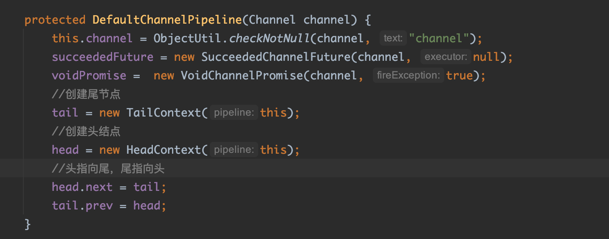
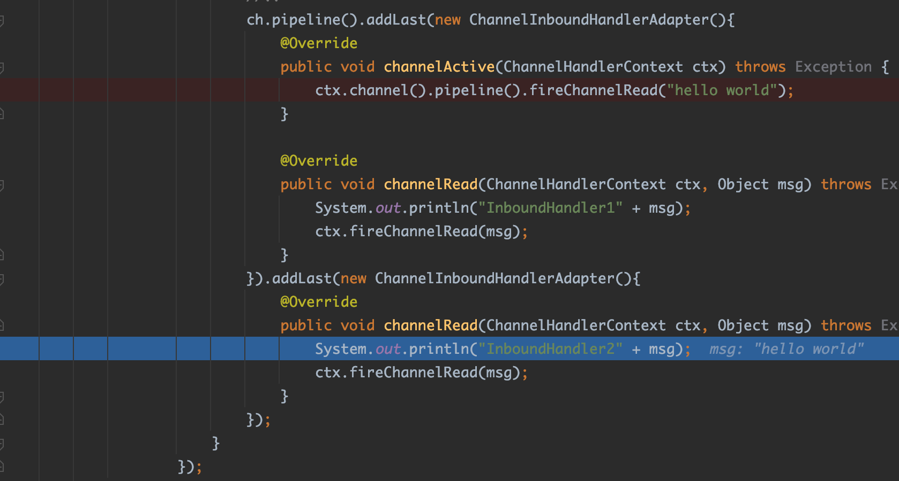
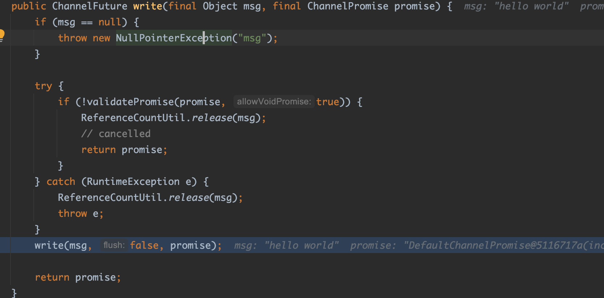

## 前言
在netty中，pipeline非常重要，我们写的handler要挂在上面实现各种各样的功能，这篇博客就分析一下pipeline。
## pipeline的创建
首先进入NioServerSocketChannel类，跟进去，到AbstractChannel的构造函数。

可以看到通过调用newChannelPipeline方法创建pipeline，跟进去

现在看一下头结点和尾节点


可以看到尾节点是一个InboundHandler，头结点既是InboundHandler又是outboundHandler。
其中注意到他们都实现AbstractChannelHandlerContext，看一下

可以看到里面有next和prev，这就说明pipeline其实是一个双向链表，里面的节点是ChannelHandlerContext。
## pipeline的添加
进入addLast方法

具体的过程我都写到代码注释里了。关键看一下addLast0方法

就是一个简单的链表添加到尾部操作。
然后要注意这个地方

这里触发一个added事件，回调handler的added方法。
## inbound事件的传播
修改原来的demo
```
public final class Server {

    public static void main(String[] args) throws Exception {
        EventLoopGroup bossGroup = new NioEventLoopGroup(1);
        EventLoopGroup workerGroup = new NioEventLoopGroup();

        try {
            ServerBootstrap b = new ServerBootstrap();
            b.group(bossGroup, workerGroup)
                    .channel(NioServerSocketChannel.class)
                    .childOption(ChannelOption.TCP_NODELAY, true)
                    .childAttr(AttributeKey.newInstance("childAttr"), "childAttrValue")
                    .handler(new ServerHandler())
                    .childHandler(new ChannelInitializer<SocketChannel>() {
                        @Override
                        public void initChannel(SocketChannel ch) {
                            //..
                            ch.pipeline().addLast(new ChannelInboundHandlerAdapter(){
                                @Override
                                public void channelActive(ChannelHandlerContext ctx) throws Exception {
                                    ctx.channel().pipeline().fireChannelRead("hello world");
                                }

                                @Override
                                public void channelRead(ChannelHandlerContext ctx, Object msg) throws Exception {
                                    System.out.println("InboundHandler1");
                                    ctx.fireChannelRead(msg);
                                }
                            }).addLast(new ChannelInboundHandlerAdapter(){
                                @Override
                                public void channelRead(ChannelHandlerContext ctx, Object msg) throws Exception {
                                    System.out.println("InboundHandler2");
                                    ctx.fireChannelRead(msg);
                                }
                            });
                        }
                    });

            ChannelFuture f = b.bind(8888).sync();

            f.channel().closeFuture().sync();
        } finally {
            bossGroup.shutdownGracefully();
            workerGroup.shutdownGracefully();
        }
    }
}
```
在```ctx.channel().pipeline().fireChannelRead("hello world");```打个断点，开始debug。
telnet一个新连接，跟进去

到headContext的channelRead方法

可以看到，找到了下一个inboundhandler，
然后又进入invokeChannelRead方法，进入我在pipeline里定义的handler

继续，走同样的过程，进入下一个handler

最后，进入tail的channelRead方法

打印debug信息

自此，inbound事件（read）的传播结束。可以看到，在pipeline触发read事件会重head传播到tail，而在context上触发只会传播到下一个inboundHandler。
## outbound事件的传播
修改原来的demo
```
public final class Server {

    public static void main(String[] args) throws Exception {
        EventLoopGroup bossGroup = new NioEventLoopGroup(1);
        EventLoopGroup workerGroup = new NioEventLoopGroup();

        try {
            ServerBootstrap b = new ServerBootstrap();
            b.group(bossGroup, workerGroup)
                    .channel(NioServerSocketChannel.class)
                    .childOption(ChannelOption.TCP_NODELAY, true)
                    .childAttr(AttributeKey.newInstance("childAttr"), "childAttrValue")
                    .handler(new ServerHandler())
                    .childHandler(new ChannelInitializer<SocketChannel>() {
                        @Override
                        public void initChannel(SocketChannel ch) {
                            //..
                            ch.pipeline().addLast(new ChannelOutboundHandlerAdapter() {
                                @Override
                                public void write(ChannelHandlerContext ctx, Object msg, ChannelPromise promise) throws Exception {
                                    System.out.println("outboundhandler1 " + msg);
                                    ctx.write(msg, promise);
                                }

                                @Override
                                public void handlerAdded(ChannelHandlerContext ctx) throws Exception {
                                    ctx.executor().schedule(() -> ctx.channel().write("hello world"), 3, TimeUnit.SECONDS);
                                }
                            }).addLast(new ChannelOutboundHandlerAdapter() {
                                @Override
                                public void write(ChannelHandlerContext ctx, Object msg, ChannelPromise promise) throws Exception {
                                    System.out.println("outboundhandler2 " + msg);
                                    ctx.write(msg, promise);
                                }
                            });
                        }
                    });

            ChannelFuture f = b.bind(8888).sync();

            f.channel().closeFuture().sync();
        } finally {
            bossGroup.shutdownGracefully();
            workerGroup.shutdownGracefully();
        }
    }
}
```
在```ctx.executor().schedule(() -> ctx.channel().write("hello world"), 3, TimeUnit.SECONDS);```打个断点，进入tail的write方法

最终进入用户handler


进入head handler


