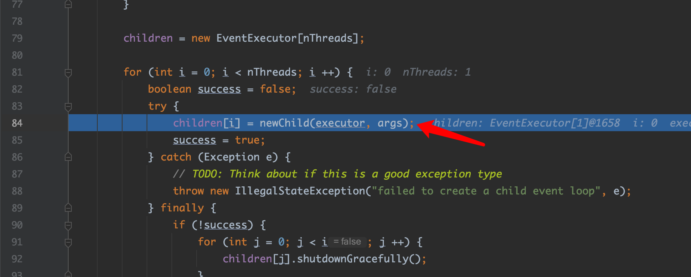
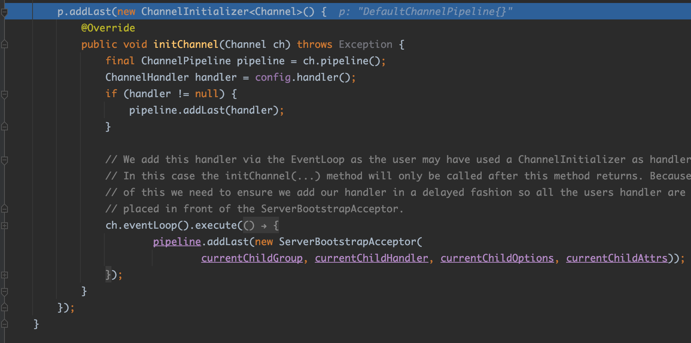
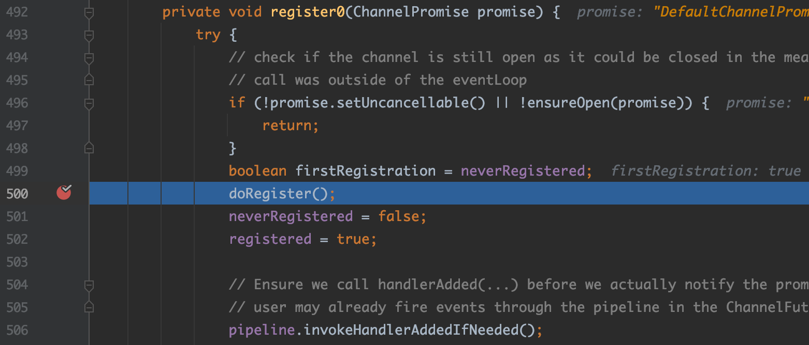
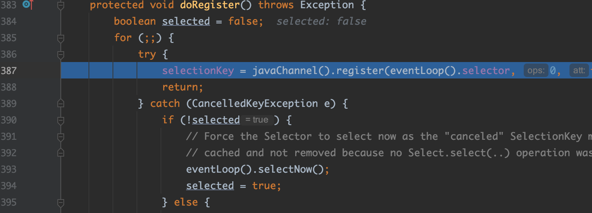
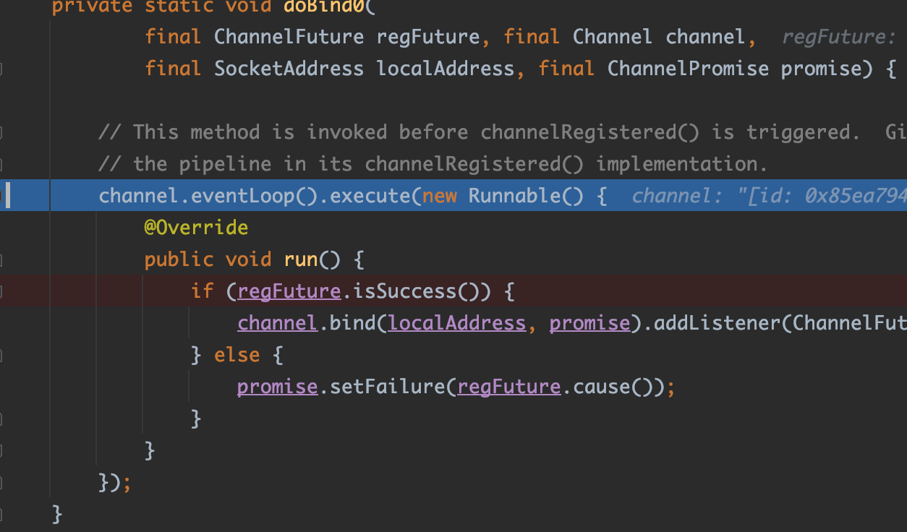

## 前言
学习netty也有两年了，一直学的不明不白，可能是因为对底层原理不太清楚的原因吧，从这篇博客开始，正式开始进行对netty源码的学习。这篇博客主要解读netty的服务端启动的过程。
## Server端示例代码
```
public final class Server {

    public static void main(String[] args) throws Exception {
        EventLoopGroup bossGroup = new NioEventLoopGroup(1);
        EventLoopGroup workerGroup = new NioEventLoopGroup();

        try {
            ServerBootstrap b = new ServerBootstrap();
            b.group(bossGroup, workerGroup)
                    .channel(NioServerSocketChannel.class)
                    .childOption(ChannelOption.TCP_NODELAY, true)
                    .childAttr(AttributeKey.newInstance("childAttr"), "childAttrValue")
                    .handler(new ServerHandler())
                    .childHandler(new ChannelInitializer<SocketChannel>() {
                        @Override
                        public void initChannel(SocketChannel ch) {
                            //..

                        }
                    });

            ChannelFuture f = b.bind(8888).sync();

            f.channel().closeFuture().sync();
        } finally {
            bossGroup.shutdownGracefully();
            workerGroup.shutdownGracefully();
        }
    }
}
```
## debug过程
### EventLoopGroup的创建过程
在```EventLoopGroup bossGroup = new NioEventLoopGroup(1);```处打个断点，一路跟下去，在MultithreadEventExecutorGroup类
的84行跟进去，在NioEventLoop类中

可以看到Selector完成了创建。
### bind过程
在```ChannelFuture f = b.bind(8888).sync();```处打个断点，跟下去，到AbstractBootstrap的doBind方法，
，在281行跟进去，
可以看到首先创建channel，然后初始化。那么channelFactory是什么呢？

可以看到在用户代码配置channel时，用用户传入的channel class对象创建ReflectiveChannelFactory，保存到channelFactory成员变量里。
然后init channel，跟进去

重点在这里，在NioServerSocketChannel的pipeline 添加一个ChannelInitializer，这是一个只用一次的handler，主要用来对channel的pipeline进行操作。

然后在330行进行channel register，进入SingleThreadEventLoop的register方法，
在AbstractUnsafe进行真正register。



可以看到真正把底层jdk的channel注册到selector上。
注意register0方法的506行，这里将会触发added事件，最终回调channel的pipeline上的ChannelInitializer，向pipeline添加ServerBootstrapAcceptor handler。
initAndRegister完成后，进行真正的bind，

继续跟，到pipeline的head节点的bind方法
，再继续，终于看到jdk的bind了（太不容易了。。。）

### 总结
1. 首先创建NioEventLoopGroup，在这一步会创建selector
2. 创建ServerBootstrap，对它进行配置后，调用bind方法
   1. initAndRegister()
      1. 创建NioServerSocketChannel
      2. init()，主要设置options和attr，并在pipeline上add ChannelInitializer
      3. 真正进行register到一个eventloop上，并触发added事件回调ChannelInitializer，
   2. doBind0，最终调用到head的bind方法， 通过调用unsafe的bind方法完成端口的绑定 
